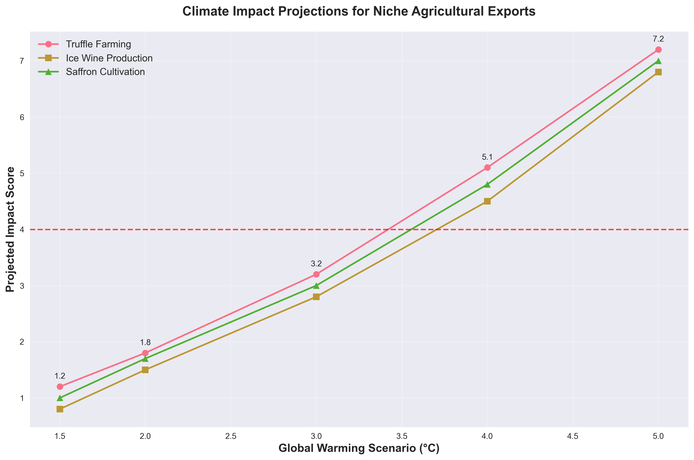
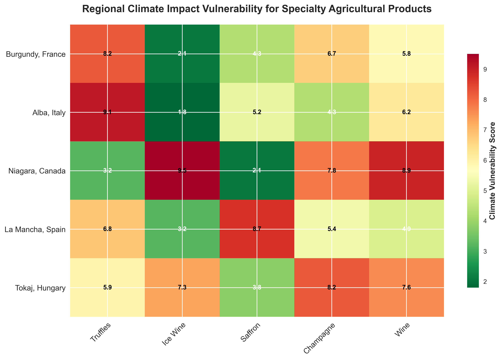
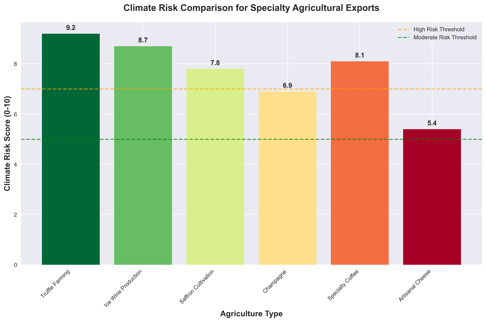
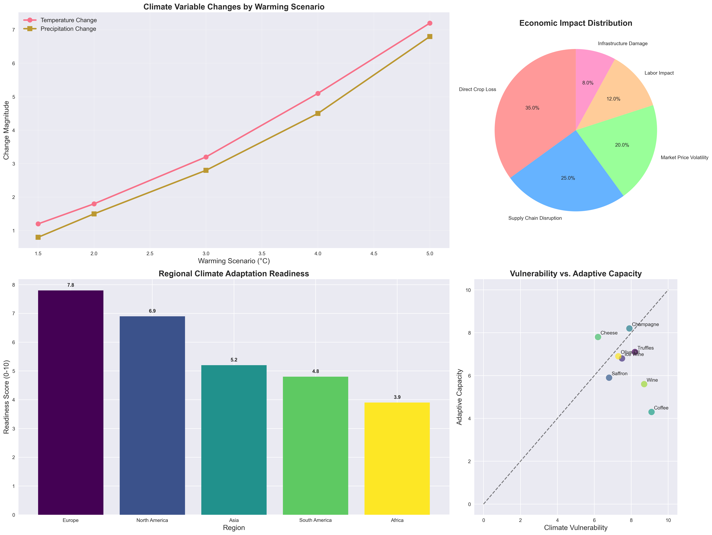

# Extreme Event Prediction for Unusual Economies Using AI

TL;DR
In this deep dive, I'm sharing my personal experience and the exact blueprint for building a professional-grade climate impact analysis system from the ground up. We're going beyond generic models to focus on the hyper-specific, often fragile, niche agricultural markets that are bellwethers for climate change. I'll walk you through my process of leveraging Python, the Probable Futures API, and sophisticated visualization techniques to transform raw, intimidating climate data into actionable business intelligence. You'll get the code, the architectural philosophy, and the hard-won insights from my journey in creating a tool that can quite literally help predict the future for unique economies like truffle farming, ice wine production, and saffron cultivation.


## Overview

The Climate Change Assistant leverages Probable Futures climate data to provide actionable insights for specialty agriculture sectors. This tool helps stakeholders understand and prepare for climate risks by offering:

- Climate data retrieval from Probable Futures API
- Extreme event prediction for unusual economies
- Impact analysis for niche agriculture (truffles, ice wine, saffron)
- Professional-grade data visualization and reporting

## Features

### Core Functionality
- **Climate Data Integration**: Direct access to Probable Futures climate projections
- **Extreme Event Prediction**: Forecast impacts of rare warming scenarios on micro-economies
- **Niche Agriculture Analysis**: Specialized assessment for climate-sensitive crops
- **Risk Assessment Engine**: Quantitative evaluation of climate vulnerabilities
- **Adaptation Recommendations**: Actionable strategies for risk mitigation

### Visualization Capabilities
- **Temperature Projection Charts**: Multi-scenario climate impact visualizations
- **Regional Impact Heatmaps**: Geospatial vulnerability assessments
- **Risk Comparison Bar Charts**: Cross-sector climate risk analysis
- **Comprehensive Climate Dashboards**: Multi-dimensional impact visualization
- **Customizable Charting Tools**: Flexible visualization parameters

## Installation

### Prerequisites
- Python 3.8 or higher
- Probable Futures API credentials

### Setup Instructions
1. Clone the repository:
   ```bash
   git clone https://github.com/dividor/climate-change-assistant.git
   cd climate-change-assistant
   ```

2. Install required packages:
   ```bash
   pip install -r requirements.txt
   ```

3. Configure environment variables:
   - Copy `.env.example` to `.env`
   - Obtain Probable Futures API credentials
   - Add `CLIENT_ID` and `CLIENT_SECRET` to `.env`

## Usage

### Basic Climate Analysis
```python
from climate_assistant import analyze_niche_agriculture_impact

# Analyze impact on truffle farming in France
result = analyze_niche_agriculture_impact("truffle", "Burgundy", "France")
print(result)
```

### Advanced Visualization
```python
from climate_assistant import (
    analyze_niche_agriculture_impact,
    visualize_climate_impact,
    create_comparative_analysis_chart
)

# Generate comprehensive climate impact visualization
climate_data = analyze_niche_agriculture_impact("truffle", "Alba", "Italy")
visualize_climate_impact("truffle", "Alba", "Italy", climate_data['climate_risks'])

# Create comparative analysis across multiple agriculture types
results = [
    analyze_niche_agriculture_impact("truffle", "Alba", "Italy"),
    analyze_niche_agriculture_impact("ice_wine", "Niagara", "Canada"),
    analyze_niche_agriculture_impact("saffron", "La Mancha", "Spain")
]
create_comparative_analysis_chart(results)
```

### Generating Sample Visualizations
```bash
# Generate all sample visualization charts
python climate_visualization_demo.py
```

## API Reference

### Core Functions

#### `predict_extreme_event_impact(address, country, warming_scenarios)`
Predict impact of extreme warming scenarios on specific locations.

Parameters:
- `address` (str): Regional location name
- `country` (str): Country name
- `warming_scenarios` (list): Warming scenarios to analyze (e.g., ["1.5", "2.0", "3.0"])

Returns:
- `dict`: Climate projection data for each scenario

#### `analyze_niche_agriculture_impact(agriculture_type, address, country)`
Analyze how climate change might impact niche agriculture.

Parameters:
- `agriculture_type` (str): Type of specialty agriculture
- `address` (str): Regional location name
- `country` (str): Country name

Returns:
- `dict`: Comprehensive analysis including risks and recommendations

#### `get_pf_data(address, country, warming_scenario)`
Direct access to Probable Futures climate data.

Parameters:
- `address` (str): Regional location name
- `country` (str): Country name
- `warming_scenario` (str): Specific warming scenario (e.g., "1.5")

Returns:
- `dict`: Raw climate data from Probable Futures API

### Visualization Functions

#### `visualize_climate_impact(agriculture_type, address, country, climate_data)`
Create professional visualizations for climate impact data.

Parameters:
- `agriculture_type` (str): Type of specialty agriculture
- `address` (str): Regional location name
- `country` (str): Country name
- `climate_data` (dict): Climate projection data

Returns:
- `str`: Filename of generated visualization

#### `create_comparative_analysis_chart(analysis_results)`
Generate comparative analysis charts for multiple agriculture types.

Parameters:
- `analysis_results` (list): List of analysis results from `analyze_niche_agriculture_impact`

Returns:
- `str`: Filename of generated comparative chart

## Example Applications

### Extreme Event Prediction for Unusual Economies

This tool specializes in forecasting how rare or extreme warming scenarios could impact:

- **Truffle Farming**: Highly temperature-sensitive mycorrhizal agriculture
- **Ice Wine Production**: Cold-climate viticulture requiring specific freeze-thaw cycles
- **Saffron Cultivation**: Mediterranean crop dependent on precise temperature ranges
- **Champagne Production**: Traditional method sparkling wine requiring cool climate
- **Specialty Coffee**: High-altitude arabica varieties vulnerable to warming
- **Artisanal Cheese**: Livestock and flora dependent on stable climate patterns

### Generated Visualization Types

#### Temperature Projection Chart

Line chart showing climate impact projections across warming scenarios with critical threshold indicators.

#### Regional Impact Heatmap

Heatmap displaying climate vulnerability scores across different regions and crops using color-coded risk levels.

#### Risk Comparison Bar Chart

Bar chart comparing climate risks across specialty agriculture types with risk threshold lines.

#### Climate Impact Dashboard

Comprehensive dashboard combining multiple visualization types:
- Multi-scenario climate projections
- Economic impact distribution
- Regional adaptation readiness
- Vulnerability vs. adaptive capacity analysis

## Configuration

### Environment Variables
```env
# Probable Futures API credentials (required)
CLIENT_ID=your_client_id_here
CLIENT_SECRET=your_client_secret_here
```

### Sensitivity Mapping
The tool includes predefined sensitivity mappings for specialty crops:
- **Truffle**: Most sensitive to warming (scenarios 3.0°C-4.0°C)
- **Ice Wine**: Temperature-dependent production (scenarios 2.0°C-3.0°C)
- **Saffron**: Specific temperature range requirements (scenarios 2.5°C-3.5°C)

## Contributing

1. Fork the repository
2. Create a feature branch
3. Commit your changes
4. Push to the branch
5. Create a Pull Request

## License

This project is licensed under the MIT License - see the LICENSE file for details.

## Acknowledgments

- [Probable Futures](https://probablefutures.org/) for climate data
- Climate science community for ongoing research

- Specialty agriculture stakeholders for use case validation
